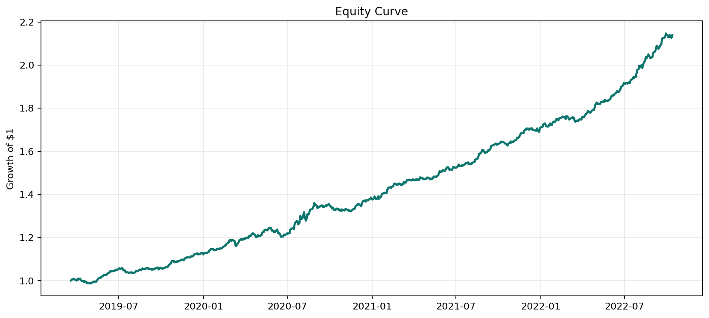
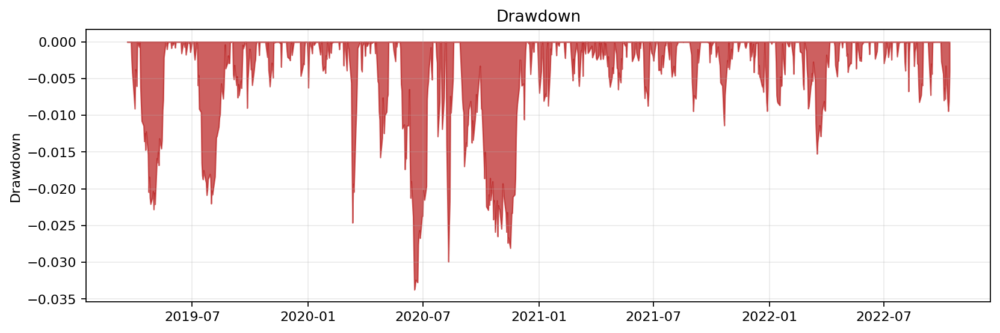
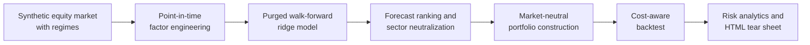

# Institutional Quant Research Lab


An end-to-end quantitative finance research platform for cross-sectional equity
alpha discovery, market-neutral portfolio construction, transaction-cost-aware
backtesting, and professional tear sheet reporting.

This project is designed to look and feel like institutional research code:
config-driven experiments, point-in-time features, purged walk-forward
validation, realistic portfolio constraints, risk diagnostics, tests, CI, and
one-command reproducibility.

## Executive Summary

Most beginner quant projects stop at a notebook and a moving-average chart.
This repository goes further: it turns a research hypothesis into a repeatable
pipeline that simulates a realistic equity universe, engineers alpha factors,
trains out-of-sample forecasts, builds a constrained long/short book, applies
costs and slippage, and publishes a tear sheet suitable for review.

The dataset is synthetic by design. That keeps the repository fully runnable
without paid market data, API keys, or vendor licensing concerns while still
demonstrating the research process expected in professional quant teams.

## Demo Results

Reproducible baseline run using `configs/base.yaml` and seed `42`:

| Metric | Value |
| --- | ---: |
| Backtest days | 932 |
| Annualized return | 22.82% |
| Annualized volatility | 4.93% |
| Sharpe ratio | 4.20 |
| Sortino ratio | 6.37 |
| Max drawdown | -3.37% |
| Hit rate | 61.37% |
| Rank IC | 0.0463 |

These are synthetic-data demonstration results, not live-trading claims. The
goal is to demonstrate research rigor, engineering quality, and risk awareness.

## Tear Sheet Preview

The pipeline generates a complete HTML tear sheet at
[`reports/generated/tear_sheet.html`](reports/generated/tear_sheet.html).





## What This Demonstrates

- **Quant research discipline**: lagged point-in-time features, next-day excess
  return targets, rolling training windows, purge gaps, and out-of-sample
  predictions only.
- **Portfolio engineering**: long/short market-neutral construction, sector
  score neutralization, volatility-adjusted sizing, gross exposure targeting,
  position caps, turnover tracking, transaction costs, and slippage.
- **Risk management**: Sharpe, Sortino, Calmar, drawdown, VaR, CVaR, hit rate,
  rolling Sharpe, regime-stress tests, and exposure diagnostics.
- **Software engineering**: modular package structure, typed Python functions,
  CLI entrypoint, YAML configs, tests, CI workflow, documentation, and
  reproducible generated artifacts.

## Methodology



The research flow follows a professional quant workflow:

1. Simulate a tradeable equity universe with market, sector, idiosyncratic, and
   regime-specific return components.
2. Generate lagged momentum, reversal, volatility, liquidity, range, beta,
   quality, and value features.
3. Predict next-day cross-sectional excess returns using a ridge model trained
   with purged walk-forward validation.
4. Rank forecasts by date, neutralize sector effects, and construct a capped
   long/short portfolio.
5. Apply explicit turnover-driven transaction costs and slippage.
6. Produce performance metrics, risk diagnostics, feature importance, regime
   analysis, and charts.

Read the full methodology in
[`docs/METHODOLOGY.md`](docs/METHODOLOGY.md).

## Quickstart

Create an environment and install dependencies:

```bash
python -m pip install -r requirements.txt
```

Run the complete research pipeline:

```bash
python -m quant_research_lab run --config configs/base.yaml
```

Expected console output:

```text
Pipeline complete
Days: 932
Sharpe: 4.20
Annualized return: 22.82%
Max drawdown: -3.37%
Rank IC: 0.0463
Tear sheet: reports/generated/tear_sheet.html
```

Run tests:

```bash
python -m unittest discover -s tests -v
```

Install as an editable package and use the console script:

```bash
python -m pip install -e .
quant-lab run --config configs/base.yaml
```

## Repository Structure

```text
.
├── configs/
│   └── base.yaml
├── docs/
│   ├── METHODOLOGY.md
│   └── RESUME.md
├── quant_research_lab/
│   ├── backtest.py
│   ├── cli.py
│   ├── config.py
│   ├── data.py
│   ├── features.py
│   ├── metrics.py
│   ├── models.py
│   ├── pipeline.py
│   ├── portfolio.py
│   └── reports.py
├── reports/
│   └── generated/
│       ├── equity_curve.png
│       ├── drawdown.png
│       ├── rolling_sharpe.png
│       ├── feature_importance.png
│       └── tear_sheet.html
├── tests/
├── pyproject.toml
├── requirements.txt
└── requirements-dev.txt
```

## Core Components

| Module | Purpose |
| --- | --- |
| `data.py` | Generates a synthetic multi-asset equity market with regimes, sector shocks, liquidity, and latent alpha. |
| `features.py` | Builds point-in-time cross-sectional factors and next-day excess return targets. |
| `models.py` | Implements recency-weighted ridge regression with purged walk-forward retraining. |
| `portfolio.py` | Converts forecasts into a sector-aware market-neutral long/short book. |
| `backtest.py` | Calculates realized PnL, turnover, transaction costs, exposure, equity, and drawdown. |
| `metrics.py` | Computes Sharpe, Sortino, Calmar, VaR, CVaR, hit rate, IC, and regime metrics. |
| `reports.py` | Exports charts, CSV artifacts, JSON metrics, and a professional HTML tear sheet. |

## Configuration

Experiments are controlled through YAML:

```yaml
model:
  train_window: 252
  purge_days: 2
  retrain_every: 5
  ridge_lambda: 25.0

portfolio:
  selection_quantile: 0.20
  gross_leverage: 1.0
  max_abs_weight: 0.05
  cost_bps: 1.5
  slippage_bps: 1.0
```

Change `configs/base.yaml` to test different universes, cost assumptions,
training windows, portfolio constraints, and random seeds.

## Resume Positioning

Copy-ready resume bullets and interview talking points are available in
[`docs/RESUME.md`](docs/RESUME.md).

Suggested one-line GitHub description:

```text
Production-style quant research lab for cross-sectional equity alpha, purged
walk-forward modeling, market-neutral backtesting, costs, risk analytics, and
HTML tear sheets.
```

## Roadmap

- Add adapters for real OHLCV data sources.
- Add borrow fees and short availability constraints.
- Add covariance-aware portfolio optimization.
- Add experiment tracking across configs and seeds.
- Add model comparison against tree-based and regularized linear baselines.
- Add a Streamlit or FastAPI dashboard for interactive research review.

## Disclaimer

This repository is for educational and portfolio demonstration purposes only.
It is not financial advice, investment advice, or a live trading system.
Synthetic results should not be interpreted as evidence of real-market
profitability.
